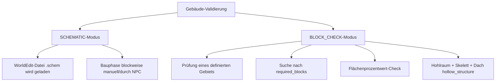
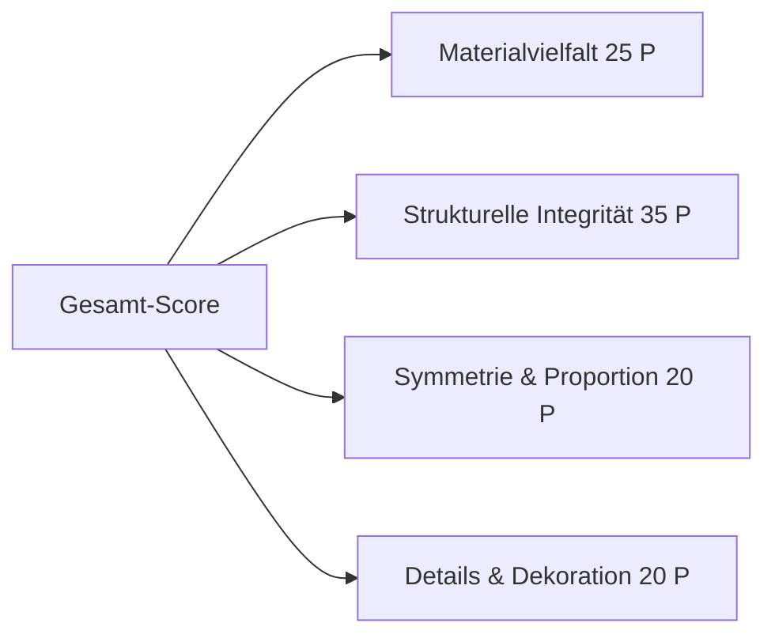
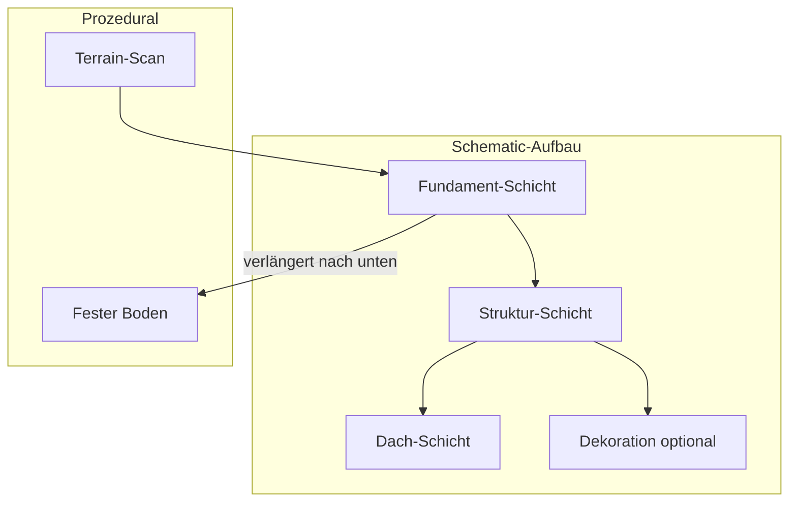

# Analyse des Gebäudesystems im Village-Plugin

Dieses Dokument fasst die Funktionsweise der Gebäude im Plugin zusammen, vergleicht die aktuellen Ansätze (`SCHEMATIC` und `BLOCK_CHECK`) und stellt Konzepte für eine verbesserte Validierung vor.

---

## 1. Wie funktionieren Gebäude im Plugin?

Im Plugin wird jedes Gebäude durch eine `BuildingDefinition` (geladen aus der `categories`-Sektion in `buildings.yml`) definiert. Es gibt zwei primäre Validierungskonzepte, um festzustellen, ob ein Gebäude existiert und betriebsbereit ist:



### A. Der Schematic-Modus (`SCHEMATIC`)
Bei diesem Modus basiert das Gebäude auf einer vordefinierten WorldEdit-Datei (`.schem`).

*   **Ablauf**:
    1. Der Spieler platziert den Ankerblock (Workstation).
    2. Das Plugin liest das Schematic-File ein.
    3. Das Gebäude wird blockweise aufgebaut (entweder manuell durch den Spieler oder in Bauphasen durch Dorfbewohner, die Baumaterialien aus Dorftruhen entnehmen).
    4. Nach Fertigstellung aller Blöcke gilt das Gebäude als validiert.
*   **Vorteile**:
    *   Optisch ansprechende, detailreiche Gebäude, die perfekt zur Dorfästhetik passen.
    *   Admins können direkt im Spiel neue Schematics abspeichern.
*   **Nachteile / Einschränkungen**:
    *   Starr und unflexibel: Das Gebäude sieht immer exakt gleich aus.
    *   Kann sich nicht an unebenes Terrain anpassen (schwebende Ecken oder vergrabene Eingänge).
    *   Upgrade-Stufen müssen oft als eigene Schematics hinterlegt werden, was die Dateigröße und den Verwaltungsaufwand erhöht.
    *   **Nach Fertigstellung** kann das Gebäude in der Welt beliebig verändert werden – die Schematic-Validierung greift nur während des Baus. Es gibt keinen laufenden Schutz der Struktur.

### B. Der Block-Check-Modus (`BLOCK_CHECK`)
Dieser Modus verzichtet komplett auf Schematic-Dateien. Stattdessen baut der Spieler frei in der Welt, und das Plugin prüft, ob bestimmte strukturelle Anforderungen erfüllt sind.

*   **Ablauf**:
    1. Der Spieler deklariert ein Gebiet (Kreis, Rechteck) um eine Workstation.
    2. Das Plugin durchsucht den Bereich periodisch:
        *   **`required_blocks`**: Prüft, ob bestimmte Materialien in Mindestanzahl im Gebiet verbaut sind (z. B. `WATER: 4` für einen Brunnen).
        *   **`required_block_percentage`**: Bestimmt, wie viel Prozent der Oberfläche aus einem bestimmten Material bestehen (z. B. `OAK_LEAVES: 40%` für einen Forst).
        *   **`hollow_structure`**: Prüft einen zusammenhängenden Hohlraum inkl. Skelett- und Dach-Validierung (siehe Abschnitt 1.1).
*   **Vorteile**:
    *   Maximale Spieler-Kreativität: Spieler können Gebäude in jedem Stil und jeder Form errichten.
    *   Sehr flexibel und ressourcenschonend (keine Schematics auf der Festplatte nötig).
    *   Ideal für naturnahe Strukturen wie Äcker, Forste oder einfache Laternen.
*   **Nachteile / Einschränkungen**:
    *   Keine Formprüfung bei einfachen Block-Counts: 4 Wasserblöcke und 32 Steine auf einem Haufen reichen theoretisch für einen Dorfbrunnen.
    *   Der reine Hohlraum-Check allein erkennt keine offenen Dächer oder fehlende Wände – daher die Skelett-/Dach-Erweiterung.

### 1.1 Skelett- und Dach-Validierung (implementiert)

Für Gebäude mit `area.shape: hollow_structure` (z. B. `baracke`) prüft `BlockCheckValidator` zusätzlich zum Mindestvolumen:

| Prüfung | Beschreibung | Schwellwert |
|---------|--------------|-------------|
| **Zusammenhängender Innenraum** | Flood-Fill ab Ankerpunkt; nur verbundene Luft zählt | `min_interior_volume` aus Config |
| **Boden** | Unter Luftblöcken muss ein solider Boden liegen | max. 15 % fehlende Bodenfläche |
| **Wände (Skelett)** | Horizontale Grenzflächen des Innenraums müssen überwiegend solide sein | min. 75 % Umschließung (Türen/Fenster erlaubt) |
| **Dach** | Über Betten und primären Workstation-Blöcken darf kein direkter Himmel sichtbar sein | Solidblock innerhalb von 6 Blöcken darüber, oder `lightFromSky == 0` |

---

## 2. Verbesserungsvorschläge für ein intelligenteres Gebäudesystem

### 2.1 Hybrid-Modus: Blueprint-Validierung – Einschätzung

**Ursprüngliche Idee:** Statt exakter Schematic-Blöcke nur funktionale Schlüsselpunkte relativ zum Anker definieren (Tür auf Y=0, Dach 3 Blöcke darüber, Bett vorhanden).

**Problem in der aktuellen Plugin-Architektur:**

Sobald ein Schematic-Gebäude einmal vollständig nachgebaut ist, gilt es als `completed`. Danach kann der Spieler die Struktur beliebig verändern – das Plugin prüft nicht erneut. Der Hybrid-Ansatz würde damit **nur während der Erstvalidierung** greifen, nicht dauerhaft.

| Aspekt | Schematic (heute) | Hybrid-Vorschlag | Bewertung |
|--------|-------------------|------------------|-----------|
| Variation zwischen Spielern | Keine (alle bauen identisch) | Keine während Bau; danach frei veränderbar | **Kein Vorteil** gegenüber Schematic |
| Aufwand für Spieler | Gleich für alle | Gleich für alle (Schlüsselpunkte müssen exakt sitzen) | **Kein Vorteil** |
| Kreative Freiheit nach Fertigstellung | Voll (kein Re-Check) | Voll (kein Re-Check) | Identisch |
| Admin-Aufwand | Schematic erstellen | Blueprint-Regeln definieren | Vergleichbar |

**Fazit:** Der Hybrid-Modus lohnt sich nur, wenn er entweder
1. **dauerhaft** die funktionalen Mindestanforderungen prüft (periodischer Re-Check wie bei `BLOCK_CHECK`), oder
2. Schematic-Gebäude in **Pflicht-Skelett** (Wände, Dach, WB-Position) und **optionale Dekoration** aufteilt.

Ohne einen dieser beiden Mechanismen bleibt der Hybrid-Modus ein Umweg: gleicher Aufwand, gleiche Variation nach Fertigstellung. **Empfehlung:** Statt Hybrid lieber `BLOCK_CHECK` mit Skelett/Dach (bereits implementiert) für freie Gebäude und Schematic für vordefinierte Landmarken – oder Schematic + Dekorations-Markierung (Abschnitt 2.4).

---

### 2.2 Ästhetik- und Komplexitäts-Score – Ausführliches Konzept

#### Ziel
Spieler sollen funktionale, aber auch optisch stimmige Gebäude bauen. Ein Score verhindert „Block-Haufen"-Exploits beim `BLOCK_CHECK` und belohnt durchdachte Architektur.

#### Score-Komponenten (0–100 Punkte gesamt)



##### B. Materialvielfalt (max. 25 Punkte)
- **Harmonische Palette:** Zähle distincte Material-Kategorien (Holz, Stein, Glas, Erde) im Gebäudebereich.
- **Penalties:** Zu viele verschiedene Materialien (>8) oder reine Monokultur (nur 1 Material) → Abzug.
- **Bonus:** Definierte Material-Paare in Config (z. B. `OAK_LOG + COBBLESTONE` für „rustikal").

```
score_material = min(25, distinct_categories * 5) - mono_penalty
```

##### C. Strukturelle Integrität (max. 35 Punkte)
- Nutzt die bestehende Skelett-/Dach-Validierung als Basis (Pflicht-Check, nicht optional).
- **Zusatz:** Vertikale Geschosshöhe 2–5 Blöcke → Bonus; Ein-Block-Korridore → Abzug.
- **Dachqualität:** Vollständige Abdeckung über dem gesamten Innenraum (nicht nur über Betten) → Bonus.

##### D. Symmetrie & Proportion (max. 20 Punkte)
- Spiegel-Symmetrie entlang einer Achse durch den Anker (optional, da nicht jedes Gebäude symmetrisch sein muss).
- **Seitenverhältnis:** Breite vs. Tiefe im Bereich 0,5–2,0 → volle Punkte; extreme Formen (1×20) → Abzug.
- Algorithmus: Vergleiche Block-Verteilung links/rechts des Ankers (Hamming-ähnlich auf 2D-Slice).

##### E. Details & Dekoration (max. 20 Punkte)
- Zähle „Dekorations-Materialien": Blumen, Fackeln, Gemälde, Teppiche, Stufen als Verzierung.
- **Minimum-Schwelle:** Unter 5 Dekorations-Blöcken → 0 Punkte in dieser Kategorie.
- **Cap:** Max. 20 Punkte ab 15+ Dekorations-Blöcken.

#### Gameplay-Auswirkungen

| Score-Bereich | Effekt (konfigurierbar) |
|---------------|-------------------------|
| 0–30 | Gebäude validiert, aber NPC-Produktivität −20 % |
| 31–60 | Normaler Betrieb |
| 61–80 | Produktivität +10 %, Dorf-Moral +2 |
| 81–100 | Produktivität +20 %, seltene Rezepte freigeschaltet, Achievement |

#### Technische Umsetzung (Roadmap)

1. **`AestheticScoreService`** – berechnet Score aus `BuildingDefinition` + Welt-Scan im `area`-Radius.
2. **Config in `buildings.yml`:**
   ```yaml
   aesthetic_scoring:
     enabled: true
     min_score_for_bonus: 61
     material_pairs:
       - [OAK_LOG, COBBLESTONE]
       - [BRICKS, DARK_OAK_PLANKS]
   ```
3. **Caching:** Score bei Fertigstellung berechnen und in `VillageBuilding` speichern; Re-Scan nur bei manuellem Trigger oder Upgrade.
4. **Feedback-GUI:** Beim Validierungs-Fehlschlag oder niedrigem Score dem Spieler eine Aufschlüsselung zeigen („Dach: OK, Materialvielfalt: 8/25").

#### Abgrenzung zur Skelett-Validierung
- **Skelett/Dach** = harte Pflicht (Gebäude funktioniert oder nicht).
- **Ästhetik-Score** = weiche Belohnung (Gebäude funktioniert immer, aber besser gebaut = besserer Output).

---

### 2.3 Modulare & Prozedurale Schematics – Ausführliches Konzept

#### Ziel
Schematic-Gebäude sollen auch an Hängen und unebenem Terrain funktionieren, ohne schwebende Ecken oder halb vergrabene Eingänge.

#### Architektur: Schematic-Schichten



##### Schicht 1: Fundament (prozedural)
- Beim Platzieren scannt das Plugin von jedem Schematic-Eckpunkt nach unten bis zum ersten soliden Block.
- **Regel:** Wähle den **tiefsten** Fundament-Punkt als Referenz; alle anderen Ecken werden mit passenden Säulen/Pfeilern aufgefüllt.
- **Material:** Aus Config oder aus dem Schematic-Fundament-Layer (markierte Blöcke `FOUNDATION` in Metadaten).
- **Max. Tiefe:** Konfigurierbar (Standard: 8 Blöcke), um extreme Klippen zu vermeiden.

##### Schicht 2: Struktur (statisch aus .schem)
- Der eigentliche Gebäudekörper bleibt unverändert.
- **Rotation:** Bestehende Richtungswahl (N/S/W/O) bleibt erhalten.

##### Schicht 3: Dach (optional adaptiv)
- Bei starkem Gefälle (>2 Blöcke Höhenunterschied an Ecken): Dach-Layer wird pro Spalte nach oben verlängert, sodass die Dachlinie parallel zum Terrain verläuft (Shed-Roof-Logik).
- Alternative: Flaches Dach mit Attika (einfacher, weniger Rechenaufwand).

#### Modulare Erweiterungen (Upgrade ohne neue Schematic)

Statt komplett neuer `.schem`-Dateien pro Tier:

```yaml
kartograph:
  schematic: "kartograph_base.schem"
  modular_extensions:
    tier_2:
      attach_at: "roof_center"   # relativer Ankerpunkt im Schematic
      module: "kartograph_tower.schem"
    tier_3:
      attach_at: "north_wall"
      module: "kartograph_balcony.schem"
```

- **`attach_at`:** Named Marker-Block im Base-Schematic (z. B. `STRUCTURE_VOID` an definierter Offset-Position).
- Beim Upgrade wird das Modul-Schematic an dieser Stelle eingefügt, ohne das Basisgebäude neu zu bauen.

#### Terrain-Anpassungs-Algorithmus (Pseudocode)

```
1. Lade Schematic-Bounding-Box (min/max X,Y,Z relativ zum Anker)
2. Für jeden (x,z) auf der Unterseite:
   a. terrainY = höchster solider Block in Welt an (anchorX+x, anchorZ+z)
   b. schematicY = Y-Offset des Fundaments in Schematic
   c. delta = terrainY - (anchorY + schematicY)
3. foundationOffset = min(delta) über alle Ecken  // tiefster Punkt gewinnt
4. Beim Platzieren: Für jeden Block unter Schematic-Fundament:
   - Wenn Welt-Block Luft → fülle mit Fundament-Material bis terrainY
5. Verschiebe Schematic um foundationOffset auf Y-Achse
```

#### Edge Cases

| Situation | Verhalten |
|-----------|-----------|
| Wasser unter Gebäude | Fundament mit Stützpfeilern; Warnung an Spieler |
| Höhenunterschied > 8 Blöcke | Platzierung verweigern mit Hinweis „Terrain zu steil" |
| Schematic überlappt mit bestehendem Block | Bestehende `confirm`-Logik beibehalten |
| Baum im Schematic-Bereich | Optional: Bäume entfernen oder Platzierung blockieren |

#### Implementierungs-Roadmap

1. **Phase 1:** Fundament-Stretching (nur nach unten) – löst 80 % der schwebenden-Gebäude-Probleme.
2. **Phase 2:** Named Marker-Blöcke in Schematics für Modul-Ankerpunkte.
3. **Phase 3:** Modulares Upgrade-System in `BuildingService`.
4. **Phase 4:** Adaptives Dach (optional, höherer Aufwand).

---

### 2.4 Ingame-Dekorations-Editor (Styling Templates) – Kurzkonzept

Admins speichern ein Gebäude ab und markieren Blöcke als `DECORATION` vs. `STRUCTURE`. Spieler müssen nur das Skelett bauen; Dekoration ist frei wählbar.

- **Speicherung:** Zusätzliche Metadaten-Datei `.schem.meta` mit Block-Klassifikation.
- **Validierung beim Bau:** Nur `STRUCTURE`-Blöcke müssen exakt stimmen; `DECORATION`-Slots dürfen leer oder mit beliebigem Block aus einer Whitelist belegt sein.
- **Verbindung zu 2.1:** Dies ist der sinnvolle Hybrid-Ansatz für Schematics – funktionale Starrheit + kreative Freiheit bei Details.

---

> [!TIP]
> **Empfehlung für die nächsten Schritte**:
> 1. ✅ **Skelett- und Dach-Validierung** für `hollow_structure` – implementiert in `BlockCheckValidator`.
> 2. **Ästhetik-Score** als nächstes sinnvolles Feature für `BLOCK_CHECK`-Gebäude (weiche Belohnung, kein Hard-Blocker).
> 3. **Fundament-Stretching** für Schematics (Phase 1 aus 2.3) – größter visueller Gewinn bei moderatem Aufwand.
> 4. Hybrid-Modus nur in Kombination mit Dekorations-Markierung (2.4) oder dauerhaftem Re-Check weiterverfolgen.
